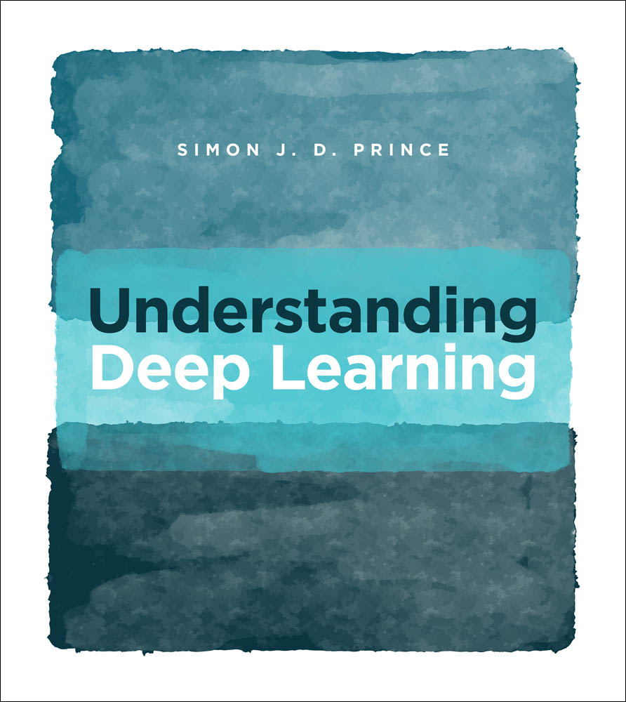

# Understanding-Deep-Learning

This repo will be a walkthrough of the book "Understanding Deep Learning" by Simon J.D. Prince

 

mamba activate udl

## Sunday, September 1, 2024

 1) mamba create -n udl
 2) mamba activate udl
 3) mamba install conda-forge::python
 4) mamba install conda-forge::jupyterlab
 5) mamba install conda-forge::matplotlib

It looks like the notebooks all have TODO items for the reader to complete. This is good!

## Saturday, September 7, 2024

Resuming this walkthrough from the newly built kitchen computer ...
